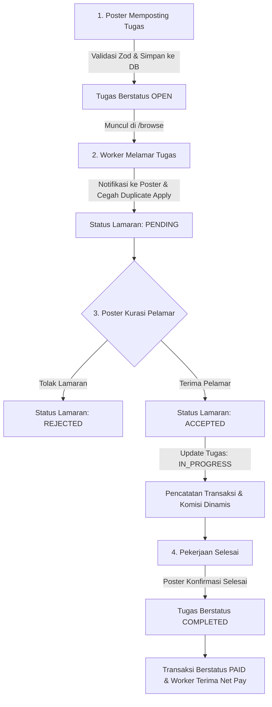

# NEAR JOB

> **Pekerjaan dekat, peluang nyata.**

Platform marketplace tugas dan pekerjaan terbuka yang menghubungkan **pemberi tugas (Poster)** dengan **pekerja tugas (Worker)** — untuk segala jenis pekerjaan: angkut barang, jaga booth, tugas harian, proyek singkat, hingga pekerjaan profesional.

---

## 🚀 Quick Start

### Prerequisites

- **Node.js** >= 20.x
- **npm** >= 10.x
- **PostgreSQL** >= 14

### Setup

```bash
# 1. Clone repository
git clone <repo-url>
cd nearjob

# 2. Install dependencies
npm install

# 3. Setup environment variables
cp .env.example .env
# Edit .env — isi DATABASE_URL dan NEXTAUTH_SECRET yang sesuai

# 4. Emit Prisma contract & TypeScript types
npm run db:emit

# 5. Rencanakan / jalankan migrasi database
npm run db:migrate

# 6. Jalankan development server
npm run dev
```

Buka [http://localhost:3000](http://localhost:3000) untuk melihat aplikasi.

---

## 🔄 Alur Bisnis Marketplace

Alur utama NEAR JOB dirancang transparan, adil, dan aman bagi kedua belah pihak:



### 1. Poster Memposting Tugas (`/post-task`)

- Poster mengisi formulir lengkap: judul tugas, kategori, tipe (Daily, Part Time, Freelance, Full Time), jobdesk, lokasi, jadwal, dan budget.
- Input divalidasi server-side menggunakan skema Zod `postTaskSchema`.
- Kalkulator komisi dinamis menampilkan estimasi biaya platform dan penghasilan bersih pekerja secara real-time.
- Poster dapat meninjau tampilan kartu tugas melalui tab **Preview** sebelum submit.

### 2. Worker Menemukan & Melamar Tugas (`/browse` → `/tasks/[id]`)

- Worker mencari pekerjaan terdekat dengan filter kategori, tipe tugas (chip berwarna), dan lokasi.
- Pada halaman detail, rincian jobdesk, lokasi, jadwal, dan breakdown komisi ditampilkan transparan.
- Worker menekan tombol **"Lamar Sekarang"** dan dapat menambahkan catatan pengantar.
- Mutasi client dilakukan secara optimistik menggunakan **React Query**.
- Server memvalidasi: user bukan pemilik tugas, tugas berstatus OPEN, dan belum pernah melamar sebelumnya.

### 3. Poster Mengkurasi Pelamar (`/dashboard`)

- Poster melihat daftar pelamar per tugas di dashboard kurasinya.
- Server-side ownership check memastikan hanya pembuat tugas yang dapat melihat dan memutuskan lamaran.
- Poster dapat memilih **"Terima"** atau **"Tolak"**.
- Ketika pelamar diterima:
  - Status lamaran menjadi `ACCEPTED`.
  - Status tugas berubah menjadi `IN_PROGRESS`.
  - Service komisi dinamis dijalankan untuk mencatat data `Transaction` (status `PENDING`).
  - Worker menerima notifikasi in-app.

### 4. Penyelesaian Tugas (`/dashboard`)

- Setelah pekerjaan selesai di lapangan, Poster menekan **"Tandai Selesai"**.
- Status tugas berubah menjadi `COMPLETED`.
- Status transaksi diperbarui menjadi `PAID`.
- Worker menerima notifikasi dan penghasilan bersih masuk ke ringkasan saldo worker.

### 5. Logika Komisi Dinamis (`calculateCommission.ts`)

Komisi platform dihitung murni menggunakan fungsi `calculateCommission(budget)`:

- **Budget < Rp50.000**: Komisi 10% (Rate: `0.10`)
- **Budget ≥ Rp50.000**: Komisi 9% (Rate: `0.09`) — _Tarif hemat untuk nominal lebih besar_
- Nilai budget ≤ 0 atau non-finite ditolak dengan error yang jelas.

---

## 📁 Struktur Folder

Proyek ini menggunakan **feature-based architecture** — setiap domain bisnis memiliki folder sendiri dengan komponen, hooks, services, dan types-nya.

```
nearjob/
├── prisma/
│   └── schema.prisma          # Database schema (Prisma ORM)
├── public/                    # Static assets
├── src/
│   ├── app/                   # Next.js App Router
│   │   ├── (auth)/            # Route group: login, register
│   │   ├── (dashboard)/       # Route group: dashboard (protected)
│   │   ├── (public)/          # Route group: halaman publik
│   │   ├── api/               # API route handlers
│   │   │   └── auth/          # NextAuth.js endpoints
│   │   ├── design-system/     # Storybook-lite preview (dev only)
│   │   ├── globals.css        # Design tokens & base styles
│   │   ├── layout.tsx         # Root layout
│   │   └── page.tsx           # Landing page
│   ├── components/
│   │   ├── providers/         # React context providers
│   │   │   └── query-provider.tsx
│   │   └── ui/                # Komponen UI dasar reusable
│   │       ├── badge.tsx
│   │       ├── button.tsx
│   │       ├── card.tsx
│   │       ├── dropdown.tsx
│   │       ├── empty-state.tsx
│   │       ├── input.tsx
│   │       ├── logo.tsx
│   │       ├── search-bar.tsx
│   │       └── index.ts       # Barrel export
│   ├── features/              # Domain modules (feature-based)
│   │   ├── applications/      # Apply & kurasi tugas
│   │   ├── auth/              # Autentikasi
│   │   ├── payments/          # Komisi & transaksi
│   │   ├── tasks/             # Posting & browsing tugas
│   │   │   ├── components/
│   │   │   ├── hooks/
│   │   │   ├── services/
│   │   │   └── types/
│   │   └── users/             # Profil & pengaturan user
│   ├── lib/                   # Shared utilities & config
│   │   ├── auth.ts            # NextAuth.js config
│   │   ├── constants.ts       # Brand constants & enums
│   │   ├── db.ts              # Prisma client singleton
│   │   ├── utils.ts           # Utility functions (cn, etc.)
│   │   └── validations.ts     # Zod schemas
│   ├── tests/                 # Test files
│   │   ├── setup.ts           # Vitest setup
│   │   ├── components/        # Component tests
│   │   └── lib/               # Utility tests
│   ├── types/                 # Global TypeScript declarations
│   │   └── next-auth.d.ts     # NextAuth type augmentation
│   └── middleware.ts           # Security headers & rate limiting
├── .env.example               # Environment variable template
├── .prettierrc                # Prettier config
├── eslint.config.mjs          # ESLint config
├── vitest.config.ts           # Vitest config
├── prisma.config.ts           # Prisma config
└── package.json
```

### Mengapa feature-based?

| Pendekatan        | Masalah                                              |
| ----------------- | ---------------------------------------------------- |
| **By type**       | Folder `components/` berisi 50+ file campur aduk     |
| **Feature-based** | ✅ Setiap domain mandiri, mudah dicari & di-refactor |

Setiap folder di `features/` berisi:

- `components/` — UI khusus fitur tersebut
- `hooks/` — React hooks untuk data fetching (TanStack Query)
- `services/` — Server-side logic & database queries
- `types/` — TypeScript types khusus domain

---

## 🎨 Design System

### Brand Tokens

Semua warna dan typography didefinisikan sebagai **design token** di `globals.css` melalui Tailwind v4 `@theme` directive. **Jangan pernah hardcode hex di komponen.**

| Token     | Nilai     | Kegunaan                    |
| --------- | --------- | --------------------------- |
| `primary` | `#2F6BFF` | CTA, link, aksi utama       |
| `dark`    | `#0F172A` | Teks heading, body utama    |
| `gray`    | `#64748B` | Teks sekunder, deskripsi    |
| `light`   | `#F1F5F9` | Background halaman          |
| `success` | `#22C55E` | Badge Full Time, status oke |
| `warning` | `#F59E0B` | Badge Freelance, peringatan |
| `error`   | `#EF4444` | Error state, validasi gagal |
| `accent`  | `#E0E7FF` | Badge Part Time, highlight  |

### Font

**Plus Jakarta Sans** — Regular 400, Medium 500, Semibold 600, Bold 700.

### Komponen UI

| Komponen   | File                 | Deskripsi                          |
| ---------- | -------------------- | ---------------------------------- |
| Logo       | `ui/logo.tsx`        | Brand mark (SVG)                   |
| Button     | `ui/button.tsx`      | Primary, outline, ghost, danger    |
| Badge      | `ui/badge.tsx`       | Label berwarna untuk tipe & status |
| Card       | `ui/card.tsx`        | Container listing tugas            |
| Input      | `ui/input.tsx`       | Text input dengan label & error    |
| SearchBar  | `ui/search-bar.tsx`  | Search utama dengan tombol Cari    |
| Dropdown   | `ui/dropdown.tsx`    | Filter dropdown (native select)    |
| EmptyState | `ui/empty-state.tsx` | Tampilan saat data kosong          |

---

## 🔒 Keamanan

### Yang sudah diimplementasi:

1. **Security Headers** — CSP, X-Frame-Options, X-Content-Type-Options, Referrer-Policy (via `middleware.ts`)
2. **Rate Limiting** — In-memory rate limiter untuk API routes (100 req/menit/IP)
3. **Input Validation** — Semua input di-validasi server-side dengan Zod (`lib/validations.ts`)
4. **Password Hashing** — bcryptjs, TIDAK pernah plaintext
5. **SQL Injection Prevention** — Prisma ORM (parameterized queries by design)
6. **Environment Secrets** — `.env` di-gitignore, `.env.example` sebagai template
7. **Auth** — NextAuth.js v5 (Auth.js) dengan JWT strategy

### Penting:

- **JANGAN** simpan secrets di kode sumber
- **JANGAN** percaya validasi client-side saja — selalu validasi ulang di server
- **JANGAN** buat sistem auth custom dari nol — gunakan NextAuth.js

---

## 🧪 Testing

```bash
# Jalankan semua test
npm test

# Watch mode (re-run saat file berubah)
npm run test:watch

# Dengan coverage report
npm run test:coverage
```

**Stack:** Vitest + React Testing Library + jest-dom

Test ditulis di `src/tests/` mengikuti struktur sumber:

- `src/tests/components/` → test komponen UI
- `src/tests/lib/` → test utility & validasi

---

## 🛠 Tooling

### Linting & Formatting

```bash
npm run lint          # Check lint errors
npm run lint:fix      # Auto-fix lint errors
npm run format        # Format semua file dengan Prettier
npm run format:check  # Check formatting tanpa mengubah file
```

### Pre-commit Hook

Husky + lint-staged otomatis menjalankan ESLint & Prettier pada file yang di-stage sebelum commit. Ini mencegah kode yang tidak rapi masuk ke repository.

### Database

```bash
npm run db:generate   # Generate Prisma client
npm run db:push       # Push schema ke database (dev)
npm run db:migrate    # Run migrations
npm run db:studio     # Buka Prisma Studio (GUI database)
```

---

## 📝 Konvensi Kode

1. **TypeScript strict mode** — `strict: true` di `tsconfig.json`
2. **Import dengan alias** — Gunakan `@/` untuk path dari `src/`, contoh: `import { Button } from "@/components/ui"`
3. **Barrel exports** — Setiap folder komponen punya `index.ts` untuk clean imports
4. **Komponen UI** — Gunakan `forwardRef` untuk komponen yang menerima `ref`
5. **Validasi** — Definisikan Zod schema di `lib/validations.ts`, jangan buat validasi ad-hoc
6. **Tone of voice** — Pesan error dan microcopy harus ramah, jelas, dan inklusif (bahasa Indonesia)
7. **Naming** — File & folder: `kebab-case`. Komponen: `PascalCase`. Fungsi & variabel: `camelCase`.
8. **Komentar** — Tulis JSDoc di setiap komponen & fungsi publik

---

## 🗺 Roadmap (Sprint Berikutnya)

- [ ] Fitur Task: posting, browsing, detail tugas
- [ ] Fitur Apply: melamar & kurasi pekerja
- [ ] Fitur Payments: komisi & transaksi
- [ ] Halaman auth: login & register form
- [ ] Dashboard poster & worker
- [ ] Real-time notifications
- [ ] Upload gambar & file
- [ ] Geolocation search

---

## 📄 License

Private — NEAR JOB © 2026
